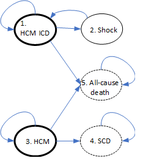

```{r setup, include=FALSE}
knitr::opts_chunk$set(echo = TRUE)
```

## Introduction

Risk score algorithm details see [@mahony2014].


## Data

The main data set contains individual-level follow-up data of patients with HCM who may have been given an ICD due to some risk decision.

Health and cost data were obtained from literature and expert opinion.
What values we wish to use will determine the form of the state model.
For instance, if cost are only accrued on entry to a state then we may use a tunnel state.
If cost depend on the patient history then we may need to duplicate a state.

Table 1 gives the unit cost and health values used in the model.

 Name | Value | Parameter | Source 
------|-------|-----------|--------
| _Health_ ||||
| Manage with ICD | 0.637 QALY/year | $h_1$ | Noyes 2007 |
| Shock | ? utility losss | $h_2$ |  |
| HCM | ? QALY/year | $h_3$ |  |
| Death | 0 QALY/year | $h_4$, $h_5$ |  |
|       |      |      |     |
| _Cost_ ||||
| Manage with ICD | ? | $c_1$ |  |
| Non-fatal HCM event | £22,880 | $c_2$ | UK Stroke Assoc. |
| HCM | ? | $c_3$ |  |
| SCD | ? | $c_4$ |  |
| All-cause death | ? | $c_5$ |  |
|      |      |      |     |

: Model parameter values.


## Methods

The individual-level patient data are first stratified in to two groups for each risk algorithm.
These are

-   Partition observed in data set
-   ICD given if number of risk factors \> 1, 2 or 3
-   ICD given if risk score \>6%
-   ICD given if risk score \>4%

We included the option of a fuzzy decision boundary such that near the threshold there is some random variation as to whether a patient received an ICD or not.

This gives us starting state populations for HCM with ICD and HCM without ICD which will be different for each risk decision rule.
Further, the transition probabilities from these states will differ because of the case mixes.

A diagram of the current cohort model is given below.

```{r fig.align="center", echo=FALSE}

```

Assuming that shocked patients return to the HCM ICD state then the transition matrix may look like the following.

$$
\begin{pmatrix}
p_{11} & p_{12} & 0 & 0 & p_{15}\\
1 & 0 & 0 & 0 & 0\\
0 & 0 & p_{33} & p_{34} & p_{35}\\
0 & 0 & 0 & 1 & 0\\
0 & 0 & 0 & 0 & 1
\end{pmatrix}
$$

We have used a year step size but if eg cost are accrued at different intervals then this can be adapted.
The time horizon is set at 12 years but can be changed.

#### Transition probability inference

Using WinBUGS called from R, each new data set is used to generate posterior samples of transition probabilities.
Denote $x$ as the observed number of transitions, $p$ the probability of a transition and $n$ as the total number of transitions from a given state. The hyperparameters $\alpha$ characterise the prior knowledge on $p$.
Superscripts indicate the decision rule used.

$$x^{(1)}_{i.} \sim \mbox{Multinomial}(p^{(1)}_{i.}, n^{(1)}_i), \;\; i = 1,3$$
$$x^{(2)}_{i.} \sim \mbox{Multinomial}(p^{(2)}_{i.}, n^{(2)}_i), \;\; i = 1,3$$

$$p^{(1)}_{i.} \sim \mbox{Dirichlet}(\boldsymbol{\alpha}^{(1)} ), \;\; i = 1,3$$
$$p^{(2)}_{i.} \sim \mbox{Dirichlet}(\boldsymbol{\alpha}^{(2)} ), \;\; i = 1,3$$

For all sink states,

$$
p^{(s)}_{ij} = \left\{
\begin{array}{ll}
1 & \mbox{if $i = j$};\\
0 & \mbox{if $i \neq j$}.
\end{array} \right.
$$


## Workflow

The main files to perform the analysis are:

-   `prep_study_data.R` munges the raw data and save the input data in `data/`
-   `BUGS/script.R` runs the BUGS code in `BUGS/model.txt`
-   `main-ce-analysis.R` performs the cost-effectiveness analysis
-   `pop_counts_plot.R` creates output plots

## Results

We give some example output to demonstrate what will be produced with the final model.

Histogram of posterior distributions for state transition probabilities.


Below is an example of state occupancy over time plot.
This shows that for the new algorithm there are fewer scd and more shocks.


# References

