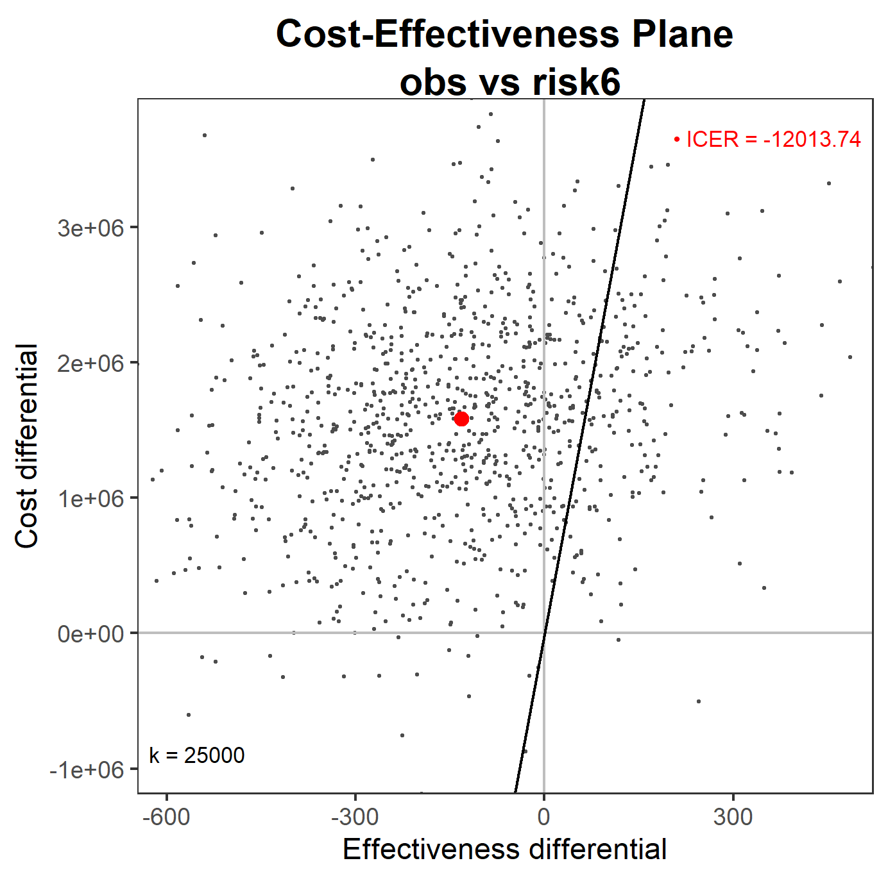

```{r setup, include=FALSE}
knitr::opts_chunk$set(echo = TRUE)
```

```{r, echo=FALSE}
data(list = params$data, package = "HCM.SCD.CEanalysis")
```

```{r echo=FALSE}
centre_tab <- dplyr::count(ipd_risk, centre)
centre <- centre_tab$centre
n <- centre_tab$n

cens_tab <- dplyr::count(ipd_risk, d)
cens <- cens_tab$d
nd <- cens_tab$n
```

## Introduction

Sudden cardiac death (SCD) risk score algorithm details see [@OMahony2014].

There have been previous cost-effectiveness analyses of ICD implants [@Magnusson2020; @Boriani2014; @Bryant2007; @Caro2007; @Cowie2009; @Garcia-Perez2015; @Mealing2016; @Sanders2005; @Smith2013]

Cost-effectiveness of a cardiovascular risk prediction algorithm.
[@Zomer2017] for statins interventions and people with severe mental illness.

[@Yao2007] use a Markov model and consider multiple implantations attempts if unsuccessful.
[@Colquitt2014] is a Health Technology Assessment which compares optimal pharmacological therapy (OPT) with or without ICD.
[@Tomini2016] is a review of economic evaluation models for cardiac resynchronization therapy with implantable cardioverter defibrillators in patients with heart failure.
[@Ommen2020] 2020 AHA/ACC Guideline for the Diagnosis and Treatment of Patients With Hypertrophic Cardiomyopathy.

## Data

The main data set contains individual-level follow-up data of patients with HCM who may have been given an ICD due to some risk decision.
Key cohort characteristics include the following.
Patients were enrolled from the 6 health centres: `r paste0(centre[1], " (", n[1], ")")`, `r paste0(centre[2], " (", n[2], ")")`, `r paste0(centre[3], " (", n[3], ")")`, `r paste0(centre[4], " (", n[4], ")")`, `r paste0(centre[5], " (", n[5], ")")`, `r paste0(centre[6], " (", n[6], ")")`; The amount of censoring was `r paste0(cens[1], " (", nd[1], ")")`, `r paste0(cens[2], " (", nd[2], ")")`; The mean age (sd) was `r round(mean(ipd_risk$age),0)` (`r round(sd(ipd_risk$age),0)`); The start of study data collection was in `r min(ipd_risk$year)` to `r max(ipd_risk$year)`. Further plots are given in the Appendix. See [@OMahony2014] for further details.

Health and cost data were obtained from literature and expert opinion.
What values we wish to use will determine the form of the state model.
For instance, if cost are only accrued on entry to a state then we may use a tunnel state.
If cost depend on the patient history then we may need to duplicate a state.

Table 1 gives the unit cost and health values used in the model.

+----------------------------------+-------------+-----------------+-------+------------------+
| Description                      | Parameter   | Value$^*$       | Range | Source           |
+==================================+=============+=================+=======+==================+
| *Health*                         |             |                 |       |                  |
+----------------------------------+-------------+-----------------+-------+------------------+
| Manage with ICD                  | `u_icd`     | 0.637 QALY/year |       | @Noyes2007       |
+----------------------------------+-------------+-----------------+-------+------------------+
| Implantation procedure utility   | `u_implant` | -0.016          |       | @Smith2013       |
+----------------------------------+-------------+-----------------+-------+------------------+
| Shock utility                    | `u_shock`   | -0.5            |       |                  |
+----------------------------------+-------------+-----------------+-------+------------------+
| HCM without ICD                  | `u_hcm`     | 1 QALY/year     |       |                  |
+----------------------------------+-------------+-----------------+-------+------------------+
| Death                            | `u_death`   | 0 QALY/year     |       |                  |
+----------------------------------+-------------+-----------------+-------+------------------+
|                                  |             |                 |       |                  |
+----------------------------------+-------------+-----------------+-------+------------------+
| *Cost*                           |             |                 |       |                  |
+----------------------------------+-------------+-----------------+-------+------------------+
| ICD appointment                  | `c_appt`    | £10             |       |                  |
+----------------------------------+-------------+-----------------+-------+------------------+
| Perform risk score               | `c_rs`      | £20?            |       |                  |
+----------------------------------+-------------+-----------------+-------+------------------+
| Implant ICD                      | `c_implant` | £4,666          |       | EY02B Tariffs    |
+----------------------------------+-------------+-----------------+-------+------------------+
| Implant replacement              | `c_repl`    | £45,000         |       |                  |
+----------------------------------+-------------+-----------------+-------+------------------+
| Implant complication             | `c_compl`   | £28,839         |       | @Smith2013       |
+----------------------------------+-------------+-----------------+-------+------------------+
| Non-fatal shock                  | `c_shock`   | £22,880         |       | UK Stroke Assoc. |
+----------------------------------+-------------+-----------------+-------+------------------+
| HCM without ICD                  | `c_hcm`     | 0               |       |                  |
+----------------------------------+-------------+-----------------+-------+------------------+
| SCD                              | `c_scd`     | 0               |       |                  |
+----------------------------------+-------------+-----------------+-------+------------------+
| All-cause death                  | `c_death`   | 0               |       |                  |
+----------------------------------+-------------+-----------------+-------+------------------+
|                                  |             |                 |       |                  |
+----------------------------------+-------------+-----------------+-------+------------------+
| *Probabilities*                  |             |                 |       |                  |
+----------------------------------+-------------+-----------------+-------+------------------+
| Initial implant complication     | `p_compl`   | 0.047           |       | @Smith2013       |
+----------------------------------+-------------+-----------------+-------+------------------+
| Replacement implant complication | `p_repl`    | 0.032           |       | @Smith2013       |
+----------------------------------+-------------+-----------------+-------+------------------+
|                                  |             |                 |       |                  |
+----------------------------------+-------------+-----------------+-------+------------------+
| Time horizon                     | `T`         | 12 years        |       |                  |
+----------------------------------+-------------+-----------------+-------+------------------+
| Implant replacement              | `t_repl`    | 10 years        |       |                  |
+----------------------------------+-------------+-----------------+-------+------------------+
| Annual number of appointments    | n_appt      | 2               |       |                  |
+----------------------------------+-------------+-----------------+-------+------------------+

: Model parameter values. $^*$either one-off/on state entry or recurring.

Table 2 gives the starting state populations for non-zero states.

+-----------------+---------+------------+
| Risk rule       | State   | Population |
+=================+=========+============+
| Observed        | HCM ICD | 559        |
+-----------------+---------+------------+
| \-              | HCM     | 3113       |
+-----------------+---------+------------+
| Score \> 4%     | HCM ICD | 2561       |
+-----------------+---------+------------+
| \-              | HCM     | 1111       |
+-----------------+---------+------------+
| Score \> 6%     | HCM ICD | 542        |
+-----------------+---------+------------+
| \-              | HCM     | 3130       |
+-----------------+---------+------------+
| Risk factor \>0 | HCM ICD | 1785       |
+-----------------+---------+------------+
| \-              | HCM     | 1887       |
+-----------------+---------+------------+
| Risk factor \>1 | HCM ICD | 481        |
+-----------------+---------+------------+
| \-              | HCM     | 3191       |
+-----------------+---------+------------+
| Risk factor \>2 | HCM ICD | 78         |
+-----------------+---------+------------+
| \-              | HCM     | 3594       |
+-----------------+---------+------------+

: Starting state populations by decision rule.

## Methods

The individual-level patient data are first stratified in to two groups for each risk algorithm.
These are

-   Partition observed in data set
-   ICD given if number of risk factors \> 0, 1 or 2
-   ICD given if risk score \> 6%
-   ICD given if risk score \> 4%

We included the option of a fuzzy decision boundary such that near the threshold there is some random variation as to whether a patient received an ICD or not.

### Markov model

Th patient data give us starting state populations for HCM with ICD and HCM without ICD which will be different for each risk decision rule.
Further, the transition probabilities from these states will differ because of the case mixes.

A diagram of the current cohort model is given in Figure \@ref(fig:model).

```{r model, fig.align="center", echo=FALSE, fig.cap="Markov model diagram. Bold circles represent starting states and dashed circles represent sink states."}

```

Assuming that shocked patients return to the HCM ICD state then the transition matrix looks like the following.

$$
\begin{pmatrix}
p_{11} & p_{12} & 0 & 0 & p_{15}\\
1 & 0 & 0 & 0 & 0\\
0 & 0 & p_{33} & p_{34} & p_{35}\\
0 & 0 & 0 & 1 & 0\\
0 & 0 & 0 & 0 & 1
\end{pmatrix}
$$

We have used a year step size but if e.g. cost are accrued at different intervals then this can be adapted.
The time horizon is set at 12 years from time of implant.

### State health and cost equations

We assume that an ICD patient has 2 annual appointments.
All shocks are treated the same in terms of costs and health impact.
Implantation can have complications.
The cost of an implant complication is taken as a weighted sum of infection and dislodgement cost with values from [@Smith2013].
Subscript $s$ denotes the state number and superscript denotes the intervention either ICD or not.

-   Annual health: $$
    e^0_{s=1}(t) = e^1_{s=1}(t) = \mbox{u\_hcm} + \mbox{u\_icd}
    $$ $$
    e^0_{s=3}(t) = e^1_{s=3}(t) = \mbox{u\_hcm}
    $$ $$
    e^0_{s=2}(t) = e^1_{s=2}(t) = \mbox{u\_shock}
    $$

$$
e^0_{s}(t) = e^1_{s}(t) = 0, \;\; s = 4,5,6
$$

-   Initial costs: $$
    c^0_{s=1}(t = 0) = \mbox{c\_icd} + \mbox{p\_compl} \times \mbox{c\_compl}
    $$

$$
c^1_{s=1}(t = 0) = \mbox{c\_icd} + \mbox{c\_rscore} + \mbox{p\_compl} \times \mbox{c\_compl}
$$

-   Annual cost: $$
    c^0_{s=1}(t) = c^1_{s=1}(t) = 2 \mbox{c\_appt}, \;\; t \neq \mbox{t\_repl}
    $$

$$
c^0_{s=2}(t) = c^1_{s=2}(t) = \mbox{c\_shock}
$$

-   Implant replacement cost $$
    c^0_{s=1}(t) = c^1_{s=1}(t) = 2 \mbox{c\_appt} + \mbox{c\_repl} + \mbox{p\_compl} \times \mbox{c\_compl}, \;\;  t = \mbox{t\_repl}
    $$

#### Transition probability inference

Using WinBUGS [@Zhang2014] called from R, each new data set is used to generate posterior samples of transition probabilities.
Denote $x$ as the observed number of transitions, $p$ the probability of a transition and $n$ as the total number of transitions from a given state.
The hyperparameters $\alpha$ characterise the prior knowledge on $p$.
Superscripts indicate the decision rule used.

$$x^{(1)}_{i.} \sim \mbox{Multinomial}(p^{(1)}_{i.}, n^{(1)}_i), \;\; i = 1,3$$

$$x^{(2)}_{i.} \sim \mbox{Multinomial}(p^{(2)}_{i.}, n^{(2)}_i), \;\; i = 1,3$$

$$p^{(1)}_{i.} \sim \mbox{Dirichlet}(\boldsymbol{\alpha}^{(1)} ), \;\; i = 1,3$$

$$p^{(2)}_{i.} \sim \mbox{Dirichlet}(\boldsymbol{\alpha}^{(2)} ), \;\; i = 1,3$$

For all sink states,

$$
p^{(s)}_{ij} = \left\{
\begin{array}{ll}
1 & \mbox{if $i = j$};\\
0 & \mbox{if $i \neq j$}.
\end{array} \right.
$$

## Results

We give results of the model fitting and cost-effectiveness analysis.

### Model fitting

Figure \@ref(fig:hist) gives a histogram of posterior distributions for state transition probabilities.

```{r hist, fig.align="center", echo=FALSE, out.width = "80%", fig.cap="Histogram of posterior distributions for state transition probabilities."}
knitr::include_graphics("posterior_histograms.png")
```

Figure \@ref(fig:statepop) gives an example of state occupancy over time plot.
This shows that for the new algorithm there are fewer SCD and more shocks.

```{r statepop, fig.align="center", echo=FALSE, fig.cap="State occupancy over time."}

```

### Cost-effectiveness

| Strategy          | Cost, $c$ | $\Delta c$ | QALYs, $e$ | $\Delta e$ | ICER |
|-------------------|-----------|------------|------------|------------|------|
| Baseline          |           |            |            |            |      |
| \> 4%             |           |            |            |            |      |
| \> 6%             |           |            |            |            |      |
| \> 1 risk factor  |           |            |            |            |      |
| \> 2 risk factors |           |            |            |            |      |

: Cost-effectiveness statistics

Figure \@ref(fig:ceac) gives the CEAC and 
Figure \@ref(fig:ceplane) gives the CE-plane.

```{r ceac, fig.align="center", echo=FALSE, fig.cap="Cost-effectiveness acceptability curve (CEAC)."}

```


```{r ceplane, fig.align="center", echo=FALSE, fig.cap="Cost-effectiveness plane."}

```


## Discussion

<!-- shared decision-making -->

Decision making as to whether have the implant is shared between patient and medical professional.
The SCD risk score is a support tool which contributes to the final decision.
An SCD risk score of 6% is treatment recommendation for one patient versus another.
There could be individual preferences that out-weighs the risk score and mean a patient chooses the alternative.

<!-- better QoL -->

Having more robust quality of life data will help to make such decisions.
more embedded PROMs research

Informatics Consult [@Lai2021] automation to scale evidence generation and to accelerate the return of results within clinical time-scales.

<!-- limitation -->

We did not include CRT-D or s-ICD but that can be overcome by sensitivity analyses that show e.g. the main message is that conclusions about the ICER etc will be robust to most departures from base assumptions other than tweaks in utility (which are the part of the model based on the weakest data!)

[@Olivotto2020] The role of new DMARDs and their ability to influence quality of life.
So if both ICD and non-ICD patients experience significant increases in QoL, are these equally distributed?

# Appendix

```{r barplot, fig.align="center", out.width = "80%", echo=FALSE, fig.cap="Year of study entry bar plot."}

```

# References
